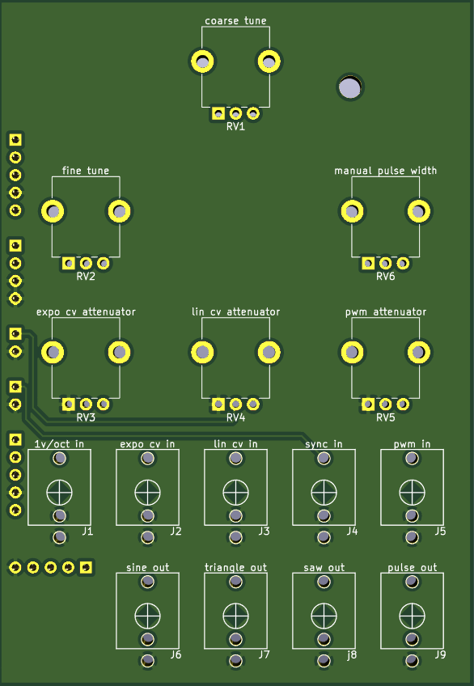
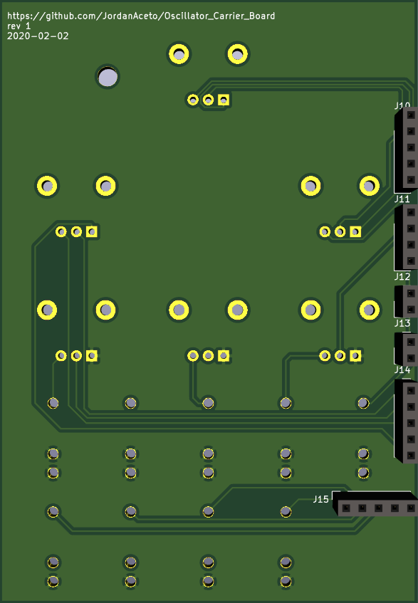

# PCB carrier board for VCO plug-in boards.

# Warning!!! This is an unverified work in progress. After building a PCB and evaluating the design I will remove this message.

### This PCB is designed to accomodate various oscillator boards documented elsewhere on my github page. Pots and jacks are mounted on this board, which can be affixed to a Eurorack panel. This way you can have one carrier board/panel, and swap in various VCO designs. 
### Since the panal and panel-mount components are typically a large expense in a synth module, this allows you to evaluate and experiment with different oscillator designs economically.
### Various plug-in boards have already been designed as part of a different project, and this seemed like an easy way to leverage an existing design in order to mess around with a Eurorack setup.

### Here is an example of one of the plug-in boards: [LINK](https://github.com/JordanAceto/CEM3340_VCO "CEM3340 VCO")

 
