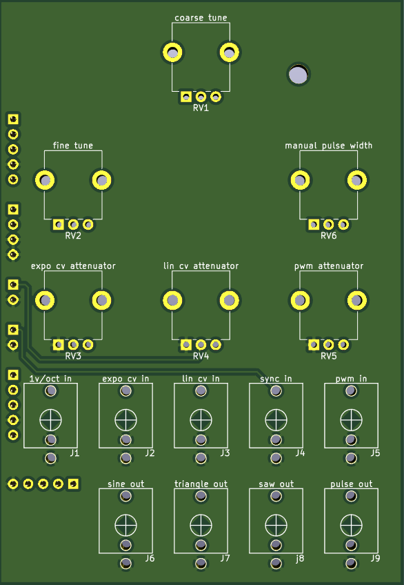
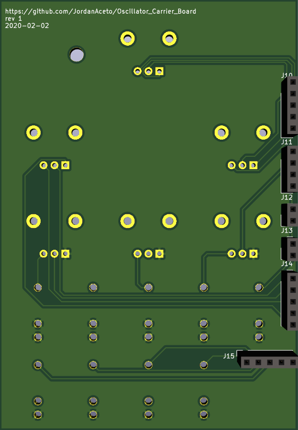

# PCB carrier board for VCO plug-in boards.

## This board houses the potentiometers, jacks, and headers which interface with a [VCO core board](https://github.com/JordanAceto/CEM3340_VCO "CEM3340 VCO")

 